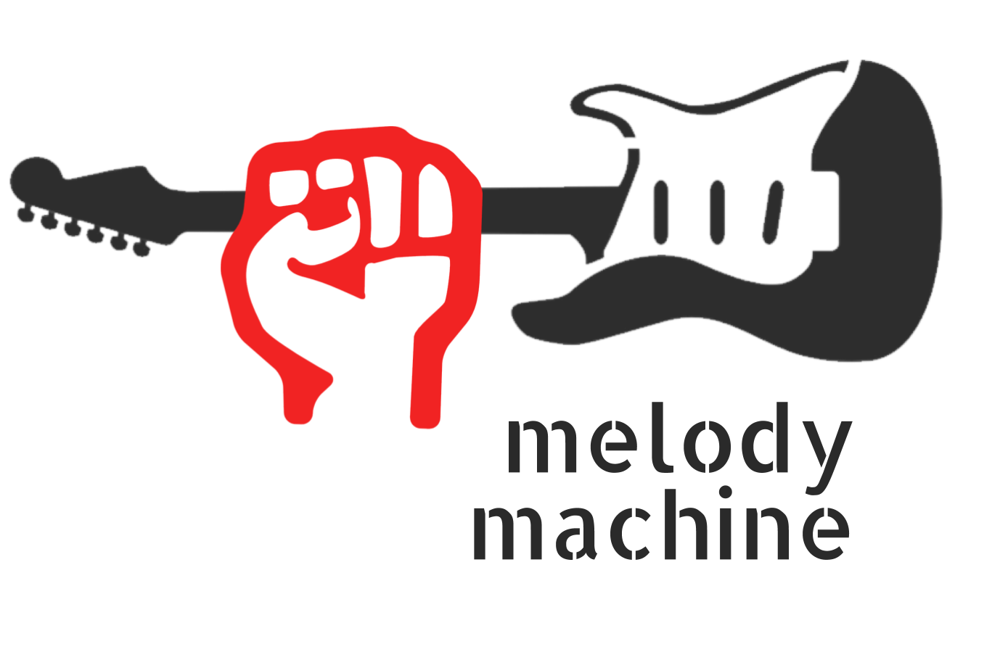
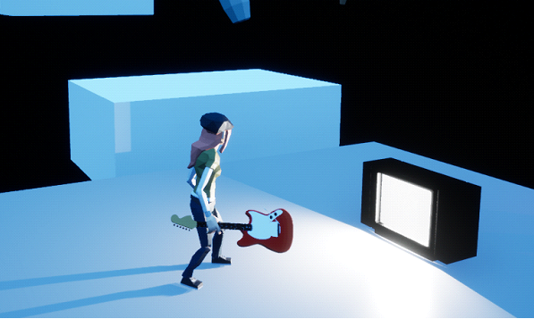

# Melody Machine

## Introduction
Melody Machine is a 3D action platformer created in Unreal Engine 4.

Alex - a 20-something millennial with a liberal arts degree and dreams of hitting it big as a rock star - seeks to escape an unhinged urban dystopia dreamscape armed with nothing but her trusty Fender Stratocaster.

Each level finds Alex jumping across moving platforms, collecting vinyls, and fending off monstrous manifestations of societal pressures and her own inner demons.
The game draws inspiration from classic 3D platformer games including:
-	Super Mario Sunshine (2002)
-	Psychonauts (2005)
-	A Hat in Time (2017)

## Controls

| Input | Function |
| - | - |
| Mouse | Camera control |
| Left-click | Attack |
| W	| Move forward |
| S	| Move backward |
| A	| Move left |
| D | Move right |
| Space bar |	Jump

## Project Information
Course:     GAM537

Section:    NSA

Professor:  George Kougioumtzoglou

Students:   Paul Seung Kyung Kim, Brendan Yawney, Daniel Sirkovich

Projects:   Midterm Project, Final Project
